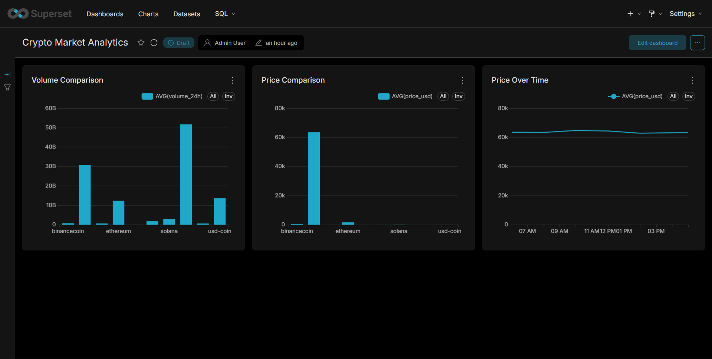

# 📈 Crypto Market Analytics Platform

A production-style data analytics platform that ingests real-time cryptocurrency market data, processes and stores it in a relational database, exposes insights through REST APIs, and visualizes trends using interactive business intelligence dashboards.

The system demonstrates an end-to-end data engineering workflow covering **ETL pipelines, API development, database management, analytics reporting, containerization, and dashboarding**.

---

## 🚀 Project Highlights

- Built an automated ETL pipeline for live cryptocurrency market data
- Processed and stored market metrics in MySQL
- Developed RESTful APIs using FastAPI
- Created interactive analytics dashboards with Apache Superset
- Generated automated Excel-based market reports
- Containerized the entire application using Docker Compose
- Integrated live data from the CoinGecko public API
- Designed a scalable architecture separating ingestion, storage, analytics, and presentation layers

---

## 🌐 Live API

**Swagger Documentation**

https://crypto-api-production-5f2d.up.railway.app/docs

---

## 🏗️ System Architecture

```text
                        ┌──────────────────┐
                        │  CoinGecko API   │
                        │  Live Market Data│
                        └─────────┬────────┘
                                  │
                                  ▼
                    ┌─────────────────────────┐
                    │      ETL Pipeline       │
                    │ ingest.py + Pandas      │
                    └─────────┬───────────────┘
                              │
                              ▼
                    ┌─────────────────────────┐
                    │      MySQL Database     │
                    │       crypto_db         │
                    └──────┬────────┬─────────┘
                           │        │
              ┌────────────┘        └────────────┐
              ▼                                  ▼
     ┌─────────────────┐              ┌─────────────────┐
     │     FastAPI     │              │ Apache Superset │
     │    REST APIs    │              │ BI Dashboards   │
     └────────┬────────┘              └────────┬────────┘
              │                                │
              ▼                                ▼
     API Consumers                    Market Analytics

                           ▼
                  ┌─────────────────┐
                  │ Excel Reports   │
                  │ openpyxl        │
                  └─────────────────┘
```

---

## 📊 Dashboard Preview



### Analytics Included

- Cryptocurrency Price Comparison
- Trading Volume Analysis
- Market Capitalization Trends
- Historical Price Tracking
- Aggregate Market Statistics

---

## ⚡ Key Features

### 🔄 Automated ETL Pipeline

- Fetches live cryptocurrency market data from CoinGecko
- Extracts top cryptocurrencies by market capitalization
- Cleans and transforms data using Pandas
- Loads structured records into MySQL

### 🌐 REST API Layer

- Built using FastAPI and Uvicorn
- Interactive Swagger documentation
- Historical and real-time market data access
- Report generation endpoints

### 📈 Business Intelligence Dashboard

- Apache Superset integration
- Interactive filtering and visualization
- Market trend exploration
- Comparative coin analysis

### 📄 Automated Reporting

- Generates formatted Excel reports
- Currency formatting and analytics summaries
- Downloadable through API endpoints

### 🐳 Containerized Deployment

- Dockerized services
- One-command deployment using Docker Compose
- Consistent local development environment

---

## 🛠️ Technology Stack

### 📊 Data Engineering

| Category | Technologies |
|-----------|-------------|
| Data Collection | CoinGecko API |
| Data Processing | Python, Pandas |
| Data Storage | MySQL 8 |

### 🌐 Backend Development

| Category | Technologies |
|-----------|-------------|
| API Framework | FastAPI |
| ASGI Server | Uvicorn |
| Documentation | Swagger/OpenAPI |

### 📈 Analytics & Reporting

| Category | Technologies |
|-----------|-------------|
| BI Dashboard | Apache Superset |
| Reports | openpyxl |
| Visualization | Superset Charts |

### ⚙️ Infrastructure

| Category | Technologies |
|-----------|-------------|
| Containerization | Docker |
| Orchestration | Docker Compose |
| Environment Management | .env |

---

### 🚀 Technology Overview

<p align="left">
  
  
  
  
  
  
</p>

---

## 📡 API Endpoints

| Method | Endpoint | Purpose |
|----------|----------|----------|
| GET | `/` | Health Check |
| GET | `/coins` | Latest Market Snapshot |
| GET | `/coins/{coin_id}/history` | Historical Price Data |
| GET | `/stats` | Market Statistics |
| GET | `/report` | Generate Excel Report |

---

## 📋 Sample API Response

```json
{
  "count": 10,
  "data": [
    {
      "coin_id": "bitcoin",
      "symbol": "btc",
      "price_usd": "62744.00",
      "volume_24h": "28543210000.00",
      "market_cap": "1234567890000.00",
      "fetched_at": "2026-06-12T00:02:52"
    }
  ]
}
```

---

## 🚀 Quick Start

### Clone Repository

```bash
git clone https://github.com/Ashmit76311/crypto-tracker.git
cd crypto-tracker
```

### Install Dependencies

```bash
python -m venv venv
venv\Scripts\activate
pip install -r requirements.txt
```

### Launch Infrastructure

```bash
docker compose up -d
```

### Run ETL Pipeline

```bash
python ingest.py
```

### Access Services

| Service | URL |
|----------|------|
| API Documentation | http://localhost:8000/docs |
| Apache Superset | http://localhost:8088 |

---

## 📂 Project Structure

```text
crypto-tracker/
│
├── main.py
├── ingest.py
├── report.py
├── schema.sql
├── docker-compose.yml
├── requirements.txt
├── .env
│
├── reports/
│
└── docs/
    └── dashboard.png
```

---

## 🎯 Skills Demonstrated

- Data Engineering
- ETL Pipelines
- REST API Development
- SQL & Database Design
- Business Intelligence
- Data Analytics
- Docker & Containerization
- Backend Development
- Data Reporting
- API Documentation

---

## 🔮 Future Enhancements

- Real-time streaming with Apache Kafka
- Automated scheduling using Apache Airflow
- Historical trend forecasting with Machine Learning
- Cloud deployment on AWS/GCP
- User authentication and role-based access
- Advanced market alerting system

---

## 👤 Author

**Ashmit Kumar Srivastav**

GitHub: https://github.com/Ashmit76311
